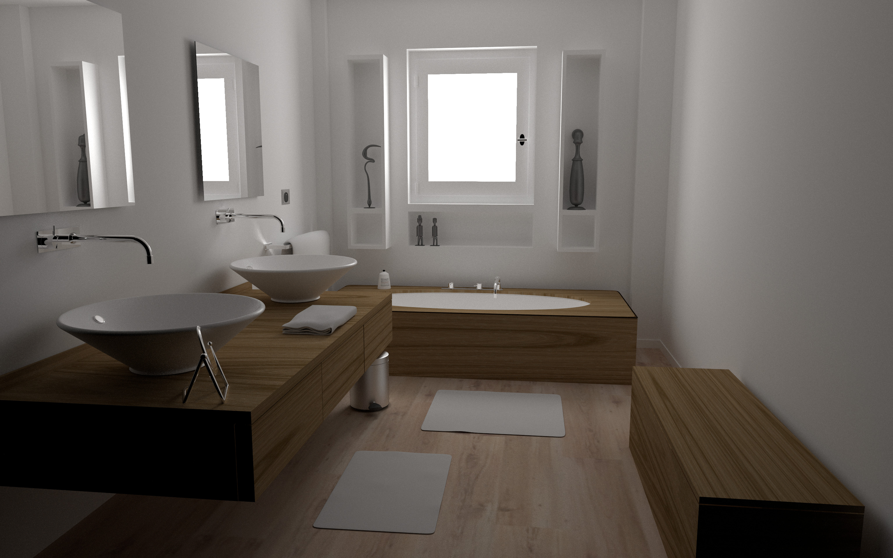

# RT: Ray Tracing Engine

A ray tracing engine written from scratch in C++, with no external dependencies (except libpng).
The first priority of this project has been to write _readable_ code, so that it can be used
as a learning tool.

## Some sample renders

## Implemented Features

Geometry:
- Arbitrary object transformations
- Wavefront OBJ parser
- Two level Bounded Volume Hierarchies
- Implicit surfaces through Ray Marching
- Signed Distance Function intersections
- Parametric Surfaces (Paraboloids, etc)*
- Surfaces of revolution*
- Beveled curves and knots*
- Displacement mapped planes / spheres*
- Basic L-Systems

> \* Converted to meshes

Shading:
- Ambient Occlusion
- Path tracing with next event estimation
- Direct Lighting

Materials (Path tracing):
- Specular reflection
- Specular transmission
- Lambertian
- Oren Nayar
- Sampled BRDFs (MERL)

Misc:
- Procedurally generated textures
- Depth of Field
- Environment Maps
- Volumetric surfaces

---

Some meshes from the following resource have been tested successfully: [McGuire Computer Graphics Archive](https://casual-effects.com/data/).

Currently the engine only supports PNG/PPM/BMP3 files, so if the textures included with the `.obj` file is in a different format, then use the provided script `./scripts/convert_images.sh`